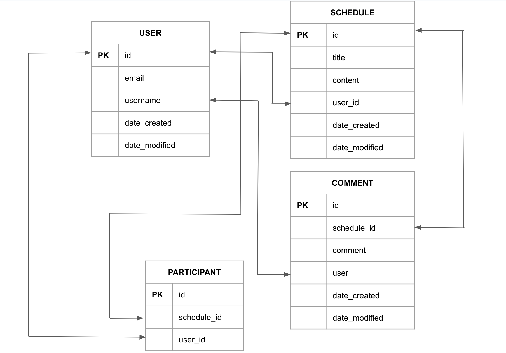

| 기능           | method | URL                 | request      | return value |
|----------------|--------|---------------------|--------------|----------|
| 일정등록       | post   | /api/schedules      | RequestBody  | -        |
| 일정 선택조회  | get    | /api/schedules/{id} | PathVariable | 선택된 일정 정보 |
| 일정 목록조회  | get    | /api/schedules      | RequestParam | 등록된 모든 일정 정보 |
| 일정 수정      | put    | /api/schedules/{id} | PathVariable, RequestBody | - |
| 일정 삭제      | delete | /api/schedules/{id} | PathVariable | -        |

## ERD

